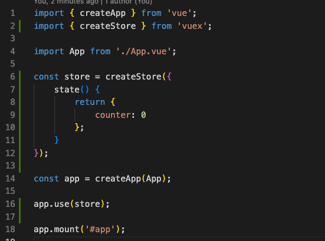
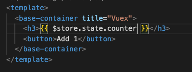
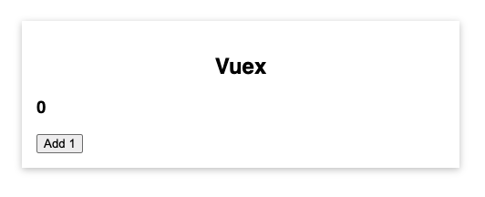
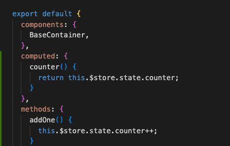
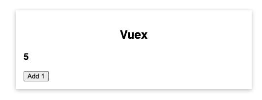

# Vuex - State Management

* Replacing provide/ inject with data that you want to share across multiple components. 
* Understanding & Using Vuex

## What is “Vuex?”

A library for managing global state

State -> Data that your component needs (Reactive data that may change/ trigger on the screen) 

Differentiate between local state and global state. 

**Local State:**

* Affects one component. 
* E.g. entered user input, show/ hide container

**Global State:**

* Affects multiple components/ entire app
* E.g. user auth status, shopping cart items

Global state is where Vuex can help us. 

Managing app-wide/ global state can be difficult.

With Vuex - outsourced state management, with predictable management flo, clearly defined data flow. 

____

## To Run

``npm i``

``npm run serve``

``npm install --save vuex``
____

## Learnings 

* main.js import createStore and initialise Store

* add store to App.vue - format is used as $store.state 

The above image now has a counter. The button does nothing... yet. 

* added methods, computer to increment the counter. 

## Images / Screenshots 

## Resources

Practice is from Udemy course by Maximilian Schwarzmüller. Vue - The Complete Guide. 